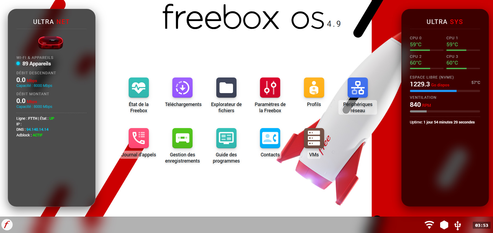

## 🛠 Prérequis & Installation

### 1. Installer l'extension Tampermonkey
Pour utiliser ce script, vous devez d'abord installer l'extension **Tampermonkey** sur un navigateur compatible :
👉 [**Télécharger Tampermonkey (Site Officiel)**](https://www.tampermonkey.net/)

| Navigateur | Compatibilité |
| :--- | :--- |
| **Google Chrome** | ✅ Testé & Approuvé |
| **Microsoft Edge** | ✅ Testé & Approuvé |
| **Brave** | ✅ Testé & Approuvé |
| **Mozilla Firefox** | ✅ Compatible |

---

### 2. Activer le "Mode Développeur" (Indispensable)
Sur certains navigateurs récents (Chrome, Edge, Brave), vous devez activer le mode développeur pour permettre l'exécution des scripts locaux :

1. Ouvrez l'onglet **Extensions** de votre navigateur (ou tapez `chrome://extensions` dans la barre d'adresse).
2. En haut à droite, activez l'interrupteur **Mode développeur**.
3. Redémarrez votre navigateur.

---

### 3. Installer le Dashboard Ultra

  
  
<i>Aperçu des panneaux Ultra Net et Ultra Sys</i>

Une fois Tampermonkey installé, choisissez votre version préférée :

* 🚀 **Version Ultra Classic** : [👉 Cliquez ici pour l'installer](https://github.com/Steven17200/freebox-os-ultra-dashboard/raw/refs/heads/main/freebox-ultra-classic-dashboard.user.js)
* 💎 **Version Ultra Limited** : [👉 Cliquez ici pour l'installer](https://github.com/Steven17200/freebox-os-ultra-dashboard/raw/refs/heads/main/freebox-ultra-limited-dashboard.user.js)

---
**Procédure :** Une page **Tampermonkey** s'ouvrira automatiquement après le clic. Cliquez simplement sur le bouton vert **"Installer"** pour activer le dashboard sur votre interface Freebox.
#### 🔑 Utilitaires (Optionnel)
* ⚡ **Auto-login Freebox OS** : [👉 Cliquez ici pour l'installer](https://github.com/Steven17200/freebox-os-ultra-dashboard/raw/refs/heads/main/Auto-login-Freebox-OS.user.js)
  > **Note :** Après l'installation, vous devrez éditer le script dans Tampermonkey pour remplacer `VOTRE_PASSWORD` par votre véritable mot de passe.

---
**Procédure :** Cliquez sur les liens ci-dessus, puis sur le bouton vert **"Installer"** dans la page Tampermonkey qui s'ouvre.
---

## 📚 Ressources & Crédits

* **Documentation Officielle** : Ce projet s'appuie sur le [SDK Freebox OS](https://dev.freebox.fr/sdk/os/) pour l'analyse des API système.
* **Intelligence Artificielle** : Les scripts de ce dashboard ont été développés avec l'aide de **Gemini 2.0 (Google)** pour l'optimisation du code et du design.
* **Auteur** : [Steven17200](https://github.com/Steven17200)
